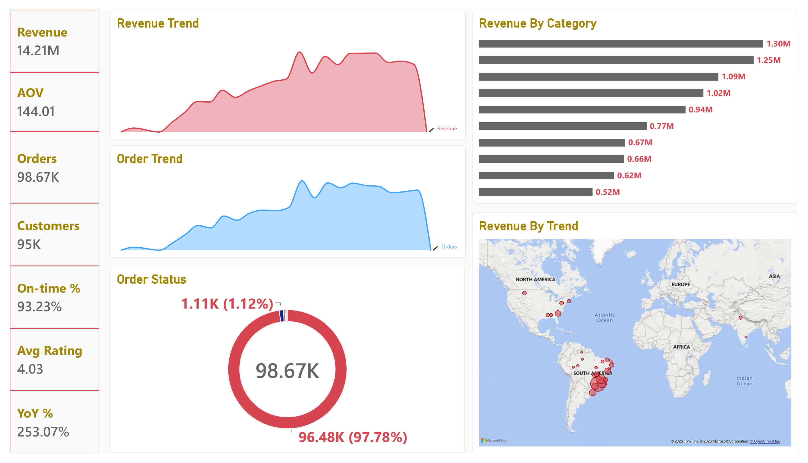
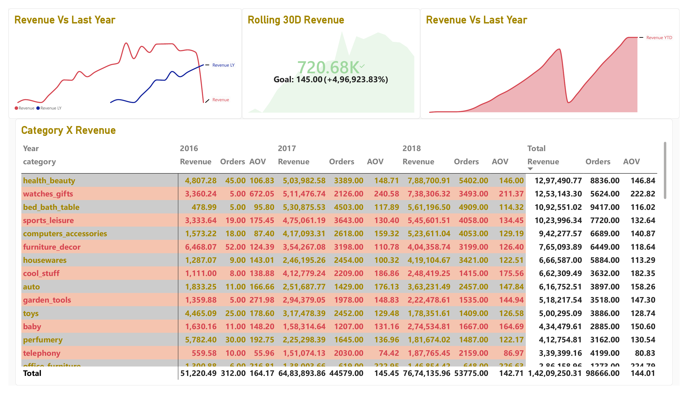
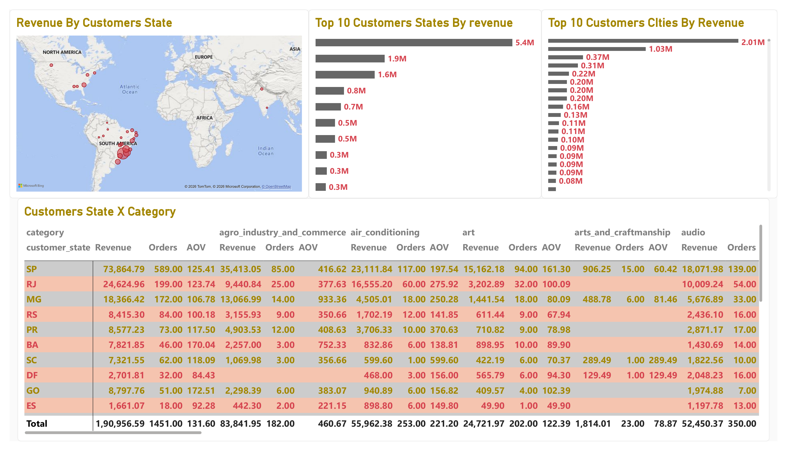
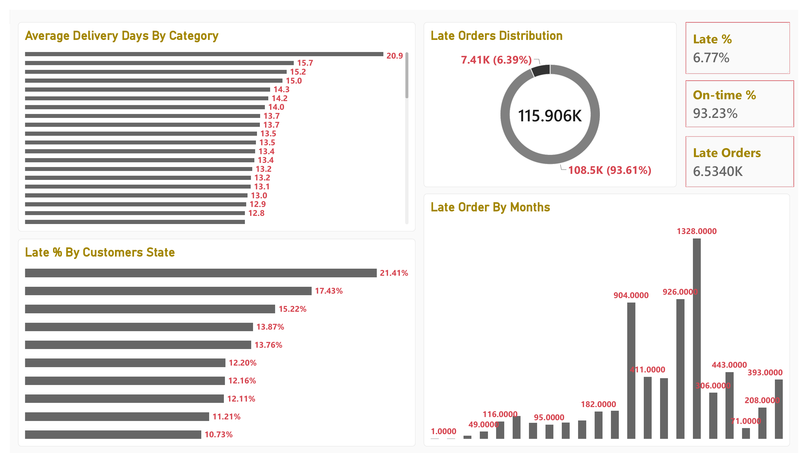

# Olist E-Commerce BI Dashboard

**PostgreSQL + Power BI analytics project** on the Brazilian Olist e-commerce dataset — raw transactional CSVs modeled into a relational schema, exposed through a SQL semantic layer, and visualized in a 9-page interactive Power BI report connected live via DirectQuery.

🔗 **Repo:** [github.com/Shubham1919284/olist-ecommerce-bi-dashboard](https://github.com/Shubham1919284/olist-ecommerce-bi-dashboard)

---

## Description

Olist is a Brazilian e-commerce marketplace that connects small businesses to major online marketplaces. This project takes ~100K real, anonymized orders (2016–2018) across 9 raw CSV tables — orders, customers, order items, products, sellers, payments, reviews, geolocation, and category translations — and turns them into a decision-ready analytics layer.

The pipeline is intentionally split into two layers:
1. **PostgreSQL** does the heavy lifting: schema design, relational integrity (PK/FK), indexing, and a semantic layer of SQL views that pre-join and pre-compute the metrics the dashboard needs.
2. **Power BI** stays thin: it connects live to those views via **DirectQuery** (no data duplication, no manual refresh) and layers DAX measures and visuals on top.

The result is a 9-page report covering sales performance, customer geography, delivery/logistics, review sentiment, payment behavior, and seller performance — plus a category-level drillthrough page.

---

## Tech Stack
**Database:** PostgreSQL, SQL (DDL, views, window/aggregate functions)
**BI Layer:** Power BI Desktop, DAX, DirectQuery
**Dataset:** [Brazilian E-Commerce Public Dataset by Olist](https://www.kaggle.com/datasets/olistbr/brazilian-ecommerce) (Kaggle)

---

## Architecture

```
 9 raw CSVs
     │
     ▼
 PostgreSQL tables  (sql/01_tables.sql)
     │  + primary keys
     │  + foreign keys        (sql/02_foreign_keys.sql)
     │  + indexes              (sql/03_indexes.sql)
     ▼
 5 BI views — fact/dimension pattern   (sql/04_bi_views.sql)
     │
     ▼
 Power BI  (DirectQuery, live connection — no data import)
     │  + DimDate calculated table
     │  + 26 DAX measures      (dax/measures.dax)
     ▼
 9-page interactive report     (docs/report_pages_spec.md)
```

---

## Data Model

### Raw tables (`sql/01_tables.sql`)
| Table | Grain | Key |
|---|---|---|
| `olist_customers_dataset` | 1 row / customer_id | PK: `customer_id` |
| `olist_orders_dataset` | 1 row / order | PK: `order_id` |
| `olist_order_items_dataset` | 1 row / item in an order | FK → orders, products, sellers |
| `olist_order_payments_dataset` | 1+ rows / order (installments) | FK → orders |
| `olist_order_reviews_dataset` | 1+ rows / order (re-reviews possible) | FK → orders |
| `olist_products_dataset` | 1 row / product_id | PK: `product_id` |
| `olist_sellers_dataset` | 1 row / seller_id | PK: `seller_id` |
| `olist_geolocation_dataset` | many rows / zip code (no PK — zip codes repeat) | — |
| `product_category_name_translation` | 1 row / category | PK: category name |

Foreign keys (`sql/02_foreign_keys.sql`) enforce: orders→customers, items→orders/products/sellers, payments→orders, reviews→orders. Indexes (`sql/03_indexes.sql`) cover every join and filter column used downstream (`order_id`, `customer_id`, `product_id`, `seller_id`, `customer_state`, `purchase_timestamp`).

### Semantic layer — 5 BI views (`sql/04_bi_views.sql`)
| View | Purpose |
|---|---|
| `bi_dim_product` | Product + English category name (via `COALESCE` translation fallback) + computed volume (cm³) |
| `bi_fact_review_latest` | One row per order — the **most recent** review, deduped with `DISTINCT ON (order_id)` |
| `bi_fact_order` | Order grain: purchase/delivered/estimated dates, `delivery_days`, `is_late` flag, de-duplicated buyer (`customer_unique_id`), city/state |
| `bi_fact_sales` | **Main fact table.** Order-item grain — joins items → `bi_fact_order` → product, latest review, payments, seller. This is the single table Power BI queries. |
| `bi_payments_order` | Payments aggregated to one row per order (sum of `payment_value`, max installments, dominant payment type) |

---

## DAX Layer (`dax/measures.dax`)

A calculated `DimDate` table (spanning the fact table's actual purchase-date range) drives all time intelligence. On top of it, 26 DAX measures cover:

- **Core KPIs:** Revenue, Freight, GMV, Orders, Customers, Items Sold, AOV, Items per Order, Avg Rating
- **Delivery:** Delivered Orders, Late Orders, On-time %, Avg Delivery Days, Late %
- **Time intelligence:** Revenue YTD, Revenue LY, YoY %, Rolling 30-Day Revenue
- **Reviews:** Positive/Negative Reviews %, Review Bucket (Positive/Neutral/Negative/No Review)
- **Payments:** Payment Value, Avg Installments
- **Sellers:** Sellers (distinct count), Revenue per Seller
- **UX:** Drill Title — dynamic drillthrough page title based on selected category

---

## Dashboard Pages

Full visual-by-visual spec (axes, values, tooltips) is in [`docs/report_pages_spec.md`](docs/report_pages_spec.md). Screenshots below are from the live report.

| # | Page | What it shows |
|---|---|---|
| 1 | **Overview** | 7 KPI cards, revenue/order trend lines, top 10 categories, revenue-by-state map, order status donut |
| 2 | **Sales Trends** | Revenue vs. last year, rolling 30-day revenue, revenue YTD, category × month matrix |
| 3 | **Category & Product** | Category revenue treemap, AOV vs. orders scatter, category × year table |
| 4 | **Customer Geo** | Revenue-by-state map, top 10 states/cities by revenue, state × category matrix |
| 5 | **Delivery & Logistics** | On-time %, late orders by month, late % by state, avg delivery days by category |
| 6 | **Reviews** | Avg rating, positive/negative review %, rating distribution, rating by category |
| 7 | **Payments** | Payment type distribution, avg installments, payment value trend, category × payment type |
| 8 | **Sellers** | Seller count, revenue per seller, top sellers/cities, seller state × category matrix |
| 9 | **Drillthrough** | Category-filtered detail page — revenue trend, order trend, state × revenue, dynamic title |

<p>
  
  
</p>
<p>
  
  
</p>

*(All 9 pages are available in [`dashboard/screenshots/`](dashboard/screenshots).)*

---

## Headline Metrics

| Metric | Value |
|---|---|
| Revenue | $14.21M |
| Orders | 98.67K |
| Customers | 95K |
| AOV | $144.01 |
| On-time Delivery | 93.23% |
| Avg Rating | 4.03 / 5 |
| YoY Growth | 253.07% |

---

## How to Reproduce

1. Download the [Olist dataset](https://www.kaggle.com/datasets/olistbr/brazilian-ecommerce) and extract the CSVs.
2. Create a PostgreSQL database and run the scripts in `sql/` in order (`01` → `04`).
3. Load the CSVs into the raw tables (`COPY ... FROM ... CSV HEADER`).
4. Open Power BI Desktop → **Get Data → PostgreSQL → DirectQuery** → connect to the `bi_*` views (mainly `bi_fact_sales`).
5. Add the `DimDate` table and the measures from `dax/measures.dax`.
6. Open `dashboard/olist_dashboard.pbix` to explore the finished report, or rebuild the pages using `docs/report_pages_spec.md`.

---

## Known Limitations

- **Geolocation unused:** `olist_geolocation_dataset` is loaded into PostgreSQL but not yet joined into any BI view — no maps or seller↔customer distance analysis are implemented. Natural next step: correlate delivery distance with delivery days.
- **Payment/rating join grain:** `bi_fact_sales` joins raw payments at order-item grain rather than through `bi_payments_order`. For orders with multiple items, this means payment-, late-order-, and rating-based totals are effectively counted at item grain rather than order grain. Normalizing to `bi_payments_order` would give strictly one-row-per-order metrics.
- **Desktop-only report:** Uses Power BI DirectQuery against a local PostgreSQL instance — no scheduled refresh or Power BI Service publishing is configured.

---

## Repository Structure

```
olist-ecommerce-bi-dashboard/
├── README.md
├── sql/
│   ├── 01_tables.sql          # Table DDL (9 tables)
│   ├── 02_foreign_keys.sql    # Relational constraints
│   ├── 03_indexes.sql         # Performance indexes
│   └── 04_bi_views.sql        # 5-view semantic layer
├── dax/
│   └── measures.dax           # DimDate + 26 DAX measures
├── dashboard/
│   ├── olist_dashboard.pbix   # Power BI report
│   └── screenshots/           # PNG export of all 9 pages
└── docs/
    └── report_pages_spec.md   # Visual-by-visual page spec
```

---

## Author

**Shubham Kumar Jha**
[GitHub](https://github.com/Shubham1919284) · [LinkedIn](https://linkedin.com/in/shubham-kumar-jha-1a2b3c)
